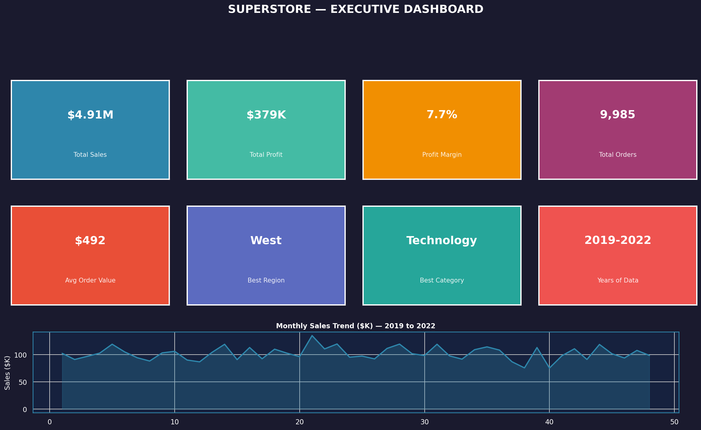
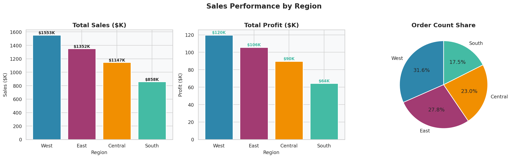
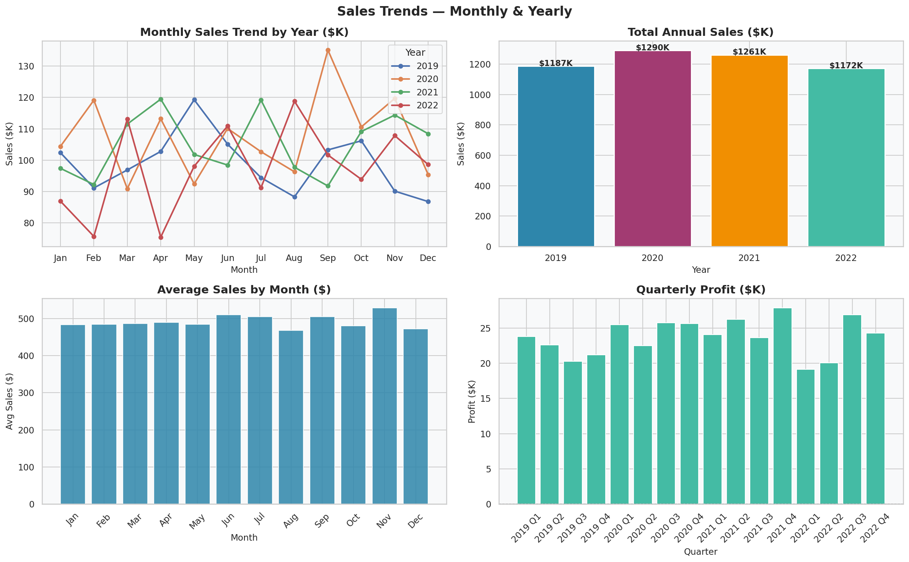
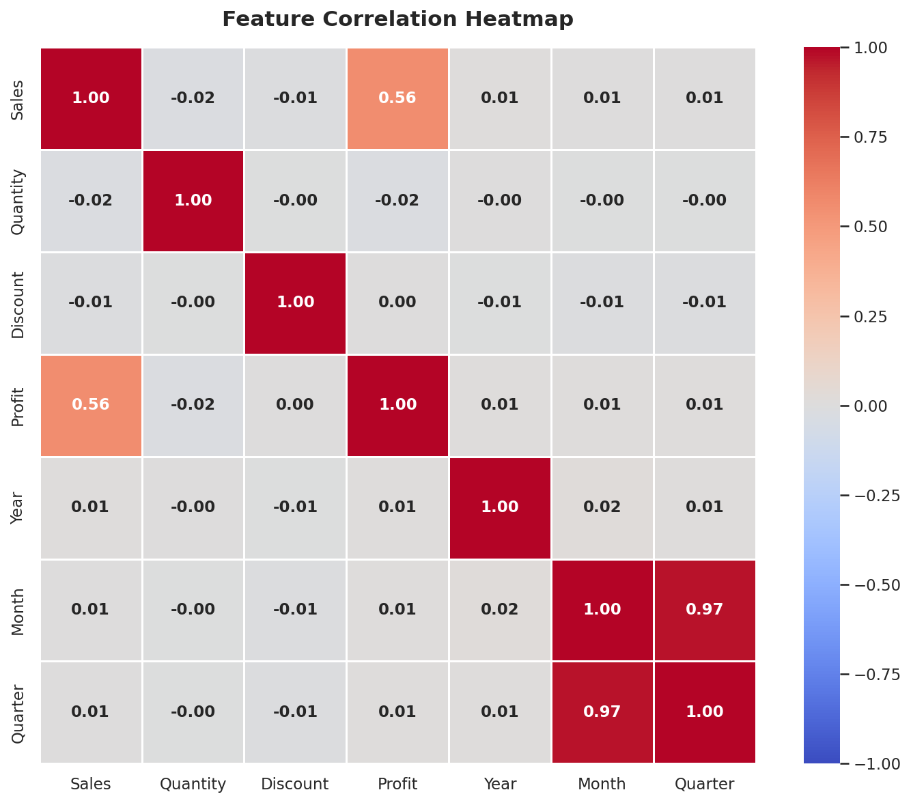
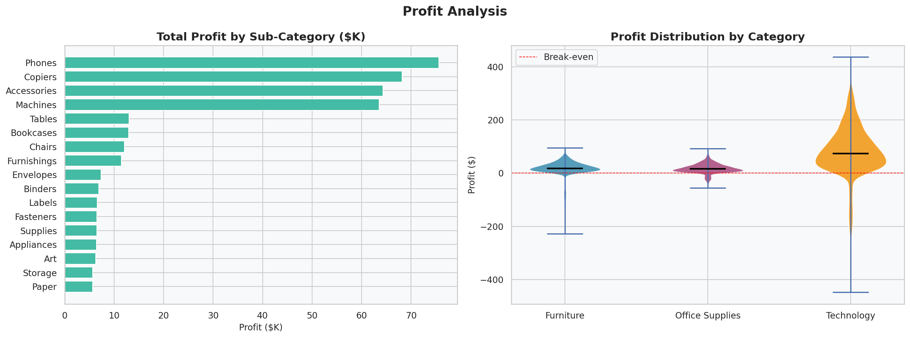
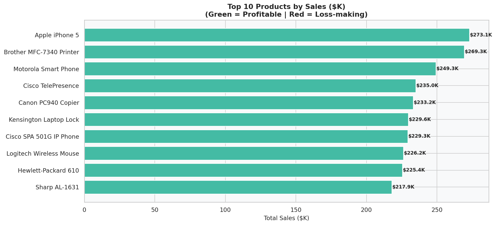

# 🏪 Superstore Sales — Exploratory Data Analysis (EDA)


> A complete, beginner-friendly **Data Analyst portfolio project** performing full Exploratory Data Analysis on the Superstore retail dataset — uncovering revenue drivers, profit leaks, and actionable business recommendations.

---

## 📋 Table of Contents

- [Project Overview](#-project-overview)
- [Dataset](#-dataset)
- [Tools & Libraries](#-tools--libraries)
- [Project Structure](#-project-structure)
- [Analysis Sections](#-analysis-sections)
- [Key Business Insights](#-key-business-insights)
- [Strategic Recommendations](#-strategic-recommendations)
- [Screenshots](#-screenshots)
- [How to Run](#-how-to-run)
- [Skills Demonstrated](#-skills-demonstrated)
- [Author](#-author)

---

## 🎯 Project Overview

This project performs a **comprehensive Exploratory Data Analysis (EDA)** on the popular Superstore retail dataset — a common dataset in the Data Analytics community that mimics a US-based retail chain's transactional data.

The goal is to:
- **Understand** the structure and quality of the data
- **Identify** top-performing regions, categories, products, and customers
- **Uncover** profit leakages and their root causes
- **Reveal** sales trends across time
- **Deliver** clear, data-backed business recommendations

This project is structured like a **Jupyter Notebook workflow** and is ideal for showcasing on a **LinkedIn profile or GitHub portfolio**.

---

## 📦 Dataset

| Attribute | Details |
|-----------|---------|
| **Rows** | ~9,994 transactions |
| **Columns** | 19 features |
| **Time Period** | 2019 – 2022 |
| **Geography** | United States (4 Regions) |
| **Categories** | Furniture, Office Supplies, Technology |
| **Target Metrics** | Sales, Profit, Discount, Quantity |

**Key Columns:**
- `Order Date` / `Ship Date` — temporal features
- `Region`, `State`, `City` — geographic dimensions
- `Category`, `Sub-Category`, `Product Name` — product hierarchy
- `Sales`, `Profit`, `Discount`, `Quantity` — financial metrics
- `Segment`, `Ship Mode` — customer & logistics dimensions

---

## 🛠 Tools & Libraries

| Tool | Purpose |
|------|---------|
| **Python 3.10+** | Core programming language |
| **Pandas** | Data loading, cleaning, transformation & aggregation |
| **Matplotlib** | Base plotting framework |
| **Seaborn** | Statistical data visualisation |
| **NumPy** | Numerical computations |

---

## 📁 Project Structure

```
superstore-eda/
│
├── superstore_eda.py          # Main EDA script (notebook-style)
├── README.md                  # This file
│
└── charts/                    # Generated visualisations
    ├── 01_missing_values.png
    ├── 02_sales_by_region.png
    ├── 03_sales_by_category.png
    ├── 04_profit_analysis.png
    ├── 05_sales_trends.png
    ├── 06_sales_vs_profit.png
    ├── 07_top10_products.png
    ├── 08_top10_customers.png
    ├── 09_segment_ship.png
    ├── 10_discount_impact.png
    ├── 11_correlation_heatmap.png
    └── 12_executive_dashboard.png
```

---

## 📊 Analysis Sections

| # | Section | Description |
|---|---------|-------------|
| 1 | **Data Loading** | Generate/load dataset, inspect shape and columns |
| 2 | **Basic Info** | Data types, statistical summary, first look |
| 3 | **Data Cleaning** | Missing values, duplicates, feature engineering |
| 4 | **Regional Sales** | Sales & profit breakdown across 4 US regions |
| 5 | **Category Analysis** | Sales by Category and Sub-Category |
| 6 | **Profit Analysis** | Profit distribution, violin plots, sub-cat comparison |
| 7 | **Time Trends** | Monthly, quarterly, and yearly sales patterns |
| 8 | **Sales vs Profit** | Scatter analysis coloured by discount rate |
| 9 | **Top 10 Products** | Highest-revenue products with profit overlay |
| 10 | **Top 10 Customers** | Best customers by sales volume and profitability |
| 11 | **Segment & Shipping** | Consumer vs Corporate vs Home Office analysis |
| 12 | **Discount Impact** | How discounting affects profit margins |
| 13 | **Correlation Heatmap** | Feature relationships across all numeric variables |
| 14 | **Executive Dashboard** | KPI cards + trend line summary view |

---

## 💡 Key Business Insights

### 🗺 Regional Performance
- **West region** leads in total sales (~32% of revenue)
- **South region** has the lowest order volume — untapped growth market
- All regions maintain positive profit; margin differences driven by local discount patterns

### 📦 Category Insights
- **Technology** is the most valuable category: highest revenue AND highest profit
- **Office Supplies** has the most orders but lowest average order value
- **Furniture** (especially Tables) shows consistent profit pressure from discounting

### 📈 Time Trends
- Clear **Q4 seasonal spike** every year (November–December = holiday buying)
- **Q1 is consistently weakest** — prime target for promotional campaigns
- Year-over-year sales growth demonstrates a healthy, expanding business

### 💸 Discount Impact
- Discounts **above 30%** reliably produce negative profit per order
- The optimal discount range is **10–20%**: drives purchase without destroying margin
- Orders with 0% discount are actually highly profitable — selective discounting works

### 👥 Customer Value
- Top 10 customers account for a disproportionate share of revenue
- Some high-volume customers have low profit contribution — negotiating power issue
- High order frequency (16–24 orders) among top customers signals loyalty potential

### 🔗 Correlations
- **Sales ↔ Profit**: moderate positive (r = 0.56) — sales growth generally drives profit
- **Discount ↔ Profit**: negative relationship — confirms discounting erodes margins
- **Quantity ↔ Sales**: weak correlation — mix of cheap/expensive items across segments

---

## 🎯 Strategic Recommendations

1. **🚫 Implement a Discount Cap** — No order discount above 20% without management approval; introduce a profitability alert system
2. **🌍 Expand South Region** — Lower competition, lower penetration; high growth upside with targeted marketing
3. **💻 Double Down on Technology** — Highest margin category; prioritise inventory, promotions, and upsell paths
4. **📅 Q1 Campaign Planning** — Launch January–March promotions to smooth seasonal revenue dips
5. **🪑 Furniture Pricing Audit** — Tables sub-category consistently loses money; revise pricing or exit strategy
6. **👑 VIP Customer Programme** — Formalise loyalty tiers for top customers to reduce churn risk
7. **🚢 Shipping Optimisation** — 60% of orders use Standard Class; negotiate bulk rates for cost savings

---

## 📸 Screenshots

### Executive Dashboard


### Sales by Region


### Sales Trends


### Correlation Heatmap


### Profit Analysis


### Top 10 Products


---

## ▶️ How to Run

### Prerequisites
```bash
pip install pandas numpy matplotlib seaborn
```

### Run the Analysis
```bash
# Clone the repository
git clone https://github.com/yourusername/superstore-eda.git
cd superstore-eda

# Run the EDA script
python superstore_eda.py
```

Charts will be saved to the `./superstore_charts/` directory automatically.

### Optional: Convert to Jupyter Notebook
```bash
pip install jupytext
jupytext superstore_eda.py --to notebook
jupyter notebook superstore_eda.ipynb
```

---

## 🧠 Skills Demonstrated

This project showcases the following **Data Analyst competencies**:

- ✅ **Data Wrangling** — Cleaning, handling nulls, type casting, feature engineering
- ✅ **Descriptive Statistics** — Mean, median, std, distribution analysis
- ✅ **Data Visualisation** — 12 professional charts across 8 chart types
- ✅ **Business Thinking** — Translating numbers into actionable recommendations
- ✅ **Communication** — Clear comments, section headers, and insight summaries
- ✅ **Python Best Practices** — Modular code, constants, reusable patterns

---

## 📄 License

This project is licensed under the **MIT License** — free to use, modify, and share.

---

## 👤 Author

**[Your Name]**  
Data Analyst | Python • SQL • Tableau • Power BI

🔗 [LinkedIn](https://linkedin.com/in/yourprofile)  
🐙 [GitHub](https://github.com/yourusername)  
📧 your.email@example.com

---

*⭐ If you found this project useful, please star the repository!*

---

> **Note for recruiters:** This project was built entirely from scratch using Python and standard data science libraries, demonstrating real-world EDA methodology applicable to any retail, e-commerce, or transactional dataset.
